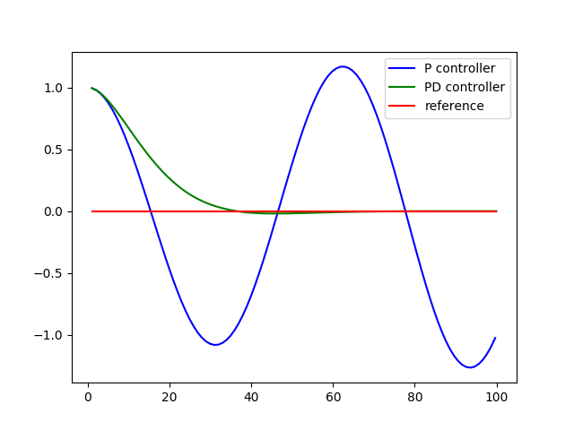
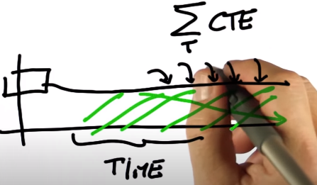
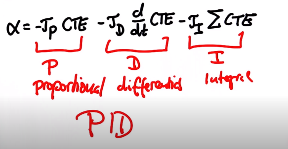
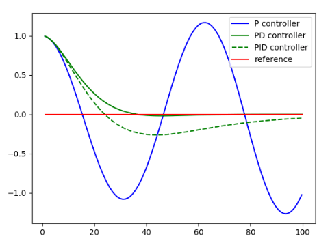

# CarND-Controls-PID

## Background
#### PID vs PD Control
<ul>
<li><code>Cross Track Error (CTE)</code> to create and enter the build directory</li>
<li><code>cmake .. &amp;&amp; make</code> to compile your project</li>
<li><code>./pid</code> to run your code</li>
</ul>

<ul><li><strong>PID</strong> </li><li>As &tau; increases, the oscillation increases. This overshoot can be addressed with a PD controller</li></ul>

<ul><li><strong>PD</strong> control accounts for the CTE as well as difference in error</li></ul>

<li></li>
<ul><li></li></ul>
<em></em>
<code></code>
<strong><strong>

#### Oscillations 

#### Systematic Bias 
Ex. Car not _exactly_ aligned --> steering drift 

Solution: Need a sustained area of large error by adding an integral of the CTE 

Therefore, steering is till proportional to all those factors list above in addition to the integral of the CTE 

***Note: The PID seems to be performing worse than PD, but this third term is only compensating for the bias.**

### Twiddle 
This is an algorithm we can use to optimize a set of parameters and find good control gains. We construct it via the following:
<ol><li>establish a vector <em>p</em> of target parameters initialized to 0</li><li>build a vector of potential changes <em>dp</em> to be probed</li><li>run(p) will output the best error thus far</li><li>iterate through parameters, increasing p and comparing the result error with the previous value</li><li>if it's less, set the best error to this new value and increment dp. Otherwise, dial p in the other direction</li><li>if both result in a higher error, decrease dp</li><li>process continues as long as the &Sigma;dp > 0.00001</li></ol>

### Final Architecture

<ul>
<li><code>mkdir build &amp;&amp; cd build</code> to create and enter the build directory</li>
<li><code>cmake .. &amp;&amp; make</code> to compile your project</li>
<li><code>./pid</code> to run your code</li>
</ul>