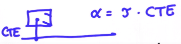
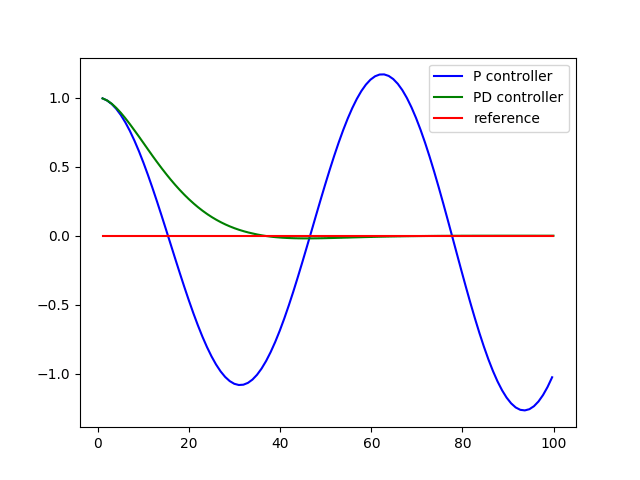
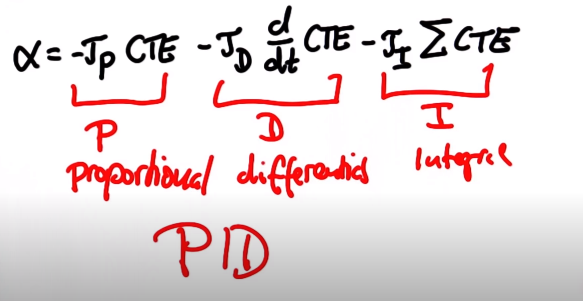

# CarND-PID-Control-Project

## Intro
**_Control_** &nbsp;is the use of steering, throttle, and break to direct a car.
#### P &#8594; PD &#8594; PID Control

<ul><li><strong>P (Proportional)</strong> </li>
<li>As &tau; increases, the oscillation increases. This overshoot can be addressed with a PD controller</li></ul>

<ul><li><strong>PD (Proportional Derivative)</strong> controls overshoot in the CTE by accounting for the change in error, meaning it will counter steer when it sees that the error is reducing overtime.</li></ul>

<ul><li><strong>PID</strong> takes into account all the latter terms in addition to the total error over time.</li></ul>

#### Systematic Bias 
This occurs as the car not _exactly_ aligned, causing a steering drift. Therefore, overtime, the car will naturally veer in the direction of the bias. The solution is to add an integral term that gauges the sum of the CT, which keeps track of the area below the trajectory line. 

 

<ul>
<li><strong>Cross Track Error (CTE):</strong>lateral distance between the vehicle and reference trajectory. </li>
<li><strong>Proportional error: </strong>term directly correlated with the CTE itself.</li>
<li><strong>Derivative error</strong> is </li>
<li><strong>Integral error</strong> compensates for system bias</li>
</ul>

***Note: The PID seems to be performing worse than PD, but this third term is only compensating for the bias.**

### Twiddle 
This is an algorithm we can use to optimize a set of parameters and find good control gains. We construct it via the following:
<ol><li>establish a vector <em>p</em> of target parameters initialized to 0</li><li>build a vector of potential changes <em>dp</em> to be probed</li><li>run(p) will output the best error thus far</li><li>iterate through parameters, increasing p and comparing the result error with the previous value</li><li>if it's less, set the best error to this new value and increment dp. Otherwise, dial p in the other direction</li><li>if both result in a higher error, decrease dp</li><li>process continues as long as the &Sigma;dp > 0.00001</li></ol>

### Architecture
1. The simulator feeds the model the vehicle's cross track error (CTE). This value is used to compute the proportional, derivative, and integral factors of the steering &alpha;	 equations, sustaining relatively uniform CTE. The goal is to periodically tweak these parameters such that it can compensate for the bias 
2. The twiddle algorithm is implemented in <code>pid.cpp</code> by first establishing total, min, and max error to prevent the model from adjusting too far in one direction and consequently result in the tall oscillations as previously shown in the graph above.  

3. The average error is calculated based on th. Error refers to the steering angle deviation. 
4. The 

### Final Model, Results, & Analysis 

When the the car was finally able to clear the track, there was still significant oscillation occurring. It would meander quite erratically along curves. Here is a snip of the printed angle values and a demo exemplifying vehicle instability during the run. 

Through trial and error, here were the observations I made while tuning each parameter in isolation: 

My baseline values for **Kp**, **Kd**, and **Ki** to simply be within the lane were 0.2, 1.0, and 0.00001 (1e-5), respectively. 

1) Decreasing **Kd** 0.2 &#8594; 0.15. Referring back to the controller graphs, this means it will oscillate more slowly, which help reduce the erratic meander along curves.  

_**More stable on bridge. &#91;0.15, 1.5, 1e-5&#93;**_ 

2) Increasing **Kd** 0.5 &#8594; 1.5: This dialed the sensitivity to steer changes, especially around curves. Graphically, it means, the curve will more gradually converge toward a CTE of 0 as opposed to drastic steering corrections. This allowed the vehicle to veer off the center a tad longer, which can be viewed as intentional overshoot, before being reoriented. Furthermore, the steering along straight paths e.g the bridge was more stable. 

 

_**More stable on bridge. &#91;0.2, 1.5, 1e-5&#93;**_ 

_**Less stable along curve. - more abrupt steering changes. &#91;0.2, 1.5, 1e-5&#93;**_

 _**Less stable along curve. - more abrupt steering changes. &#91;0.2, 1.25, 1e-5&#93;**_

3) Increasing **Ki** 
This resulting behvaior aligns with the equations since we know the integral term is a summation of _all_ the CTE's observed, represented by the area under the trajectory line . Therefore, as you increase the integral coefficient, you are essentially assigning more weight to the. Tweaking this parameter had a lesser effect on performance as there was no significant bias inherent to the simulator vehicle. 

**Final Model**  
<!--**Kp** = 0.135, -->
<!--**Kd** = 1.28, -->
<!--**Ki** = 1.75e-5-->

 _**Kp** = 0.135, **Kd** = 1.28, **Ki** = 1.75e-5_

### Conclusion 
At the sharper turns, I still would have preferred less abrupt "tugging" back to the center. Additionally, there could have been more stabilization during relatively straight portion of the track. Given more time, I would not had kept the throttle constant, dialing it down slightly upon sharper turns but maintaining the upper limit along straighter paths. 

